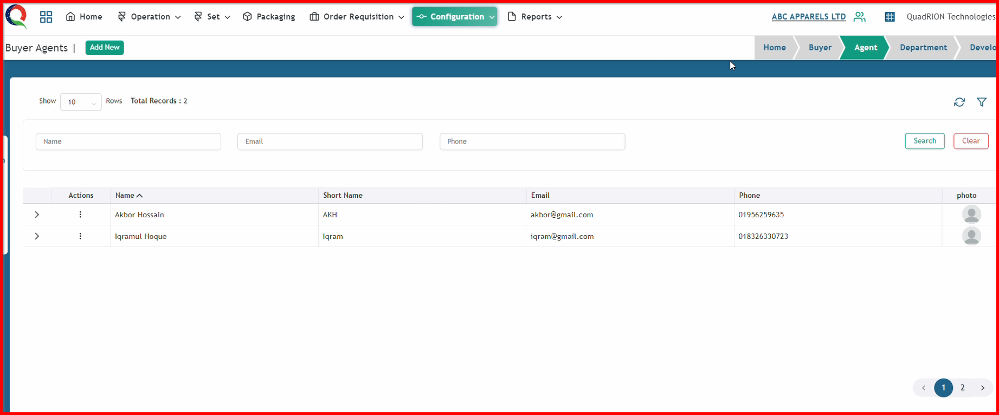

 

**Step 1:** First, click the Configuration menu of the Merchandising module, then click the Buyer Management sub-menu, and finally, click Buyer Agents

After clicking Buyer Agents button, this buyer agents page will open.

**Step 2:** Click "Add New" button to open Buyer Agent add form.

After clicking Buyer Department button, this buyer Agent form will open.

**Step 3:** Now, input all the information in this form and click the 'Submit' button.

After clicking the 'Submit' button, the buyer agent will be saved, and a success message will be displayed.

**Step 4:** Open the buyer information that you have already saved, or create a new buyer. If you want to add an agent to your buyer information, first click the 'Agent' button.

After clicking the 'Agent' button, the agent dropdown box will become visible.

**Step 5:** Now, type your agent's name and select your agent from the list that you saved previously on the Buyer Agent page.

After clicking the agent's name, the buyer agent will be saved in your buyer information, and a success message will be displayed.

**Step 6:** If you haven't created an agent on the Buyer Agent page, you can also create an agent instantly from here and save it into the buyer information.

First, type your new agent's name, then select your agent's name using the 'Create' option.

After clicking the new agent's name with the 'Create' option, you will see the new agent form.

Now, input all the information in this form and click the 'Submit' button.

So , new agent will also save in buyer information with showing successful message.

