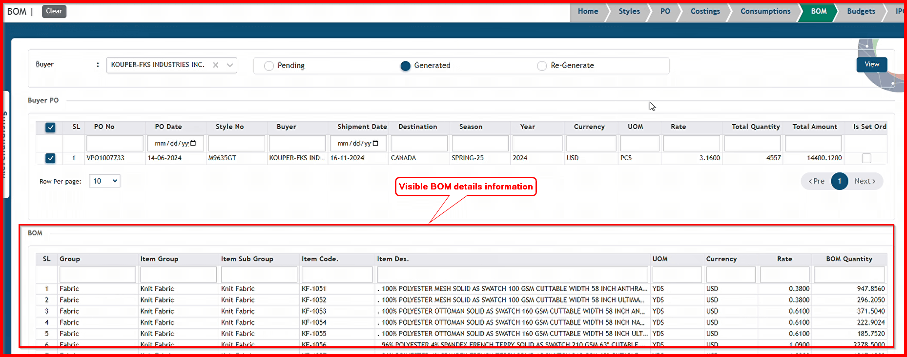
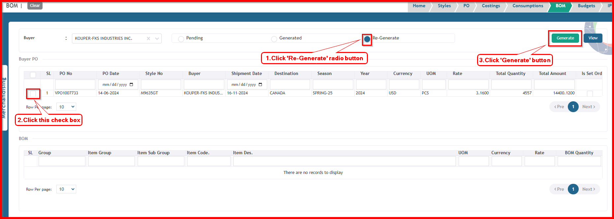

 

**Step 1:** First, click the Operation menu of the Merchandising module, then click the BOM sub-menu.

After clicking 'BOM' sub-menu, this BOM  page will open.

**Step 2:** Select your buyer from dropdown list. 

After selecting 'Buyer,' the Buyer PO information will be visible for BOMs in a pending state for the first time.

**There have three state in bom**

1. **Pending**  
  
2. **Generated**  
   
3. **Re-Generate** 
   
**Step 3:** To generate a BOM, first select the checkbox for the Buyer PO information, then click the 'Generate' button.

After clicking the 'Generate' button, the BOM will be generated, and a success message will be displayed.

To open generated states, click 'Generated' radio button.

After clicking the 'Generated' radio button, the Buyer PO information will be displayed in the generated state.

To view BOM details, first select the checkbox for the Buyer PO information, then click the 'View' button.

After clicking the 'View' button, the detailed information of the BOM will be displayed.

If your BOM needs to be re-generated, first open the Re-Generate state by clicking the 'Re-Generate' radio button. Then, select the checkbox for the Buyer PO information and click the 'Generate' button.

 

