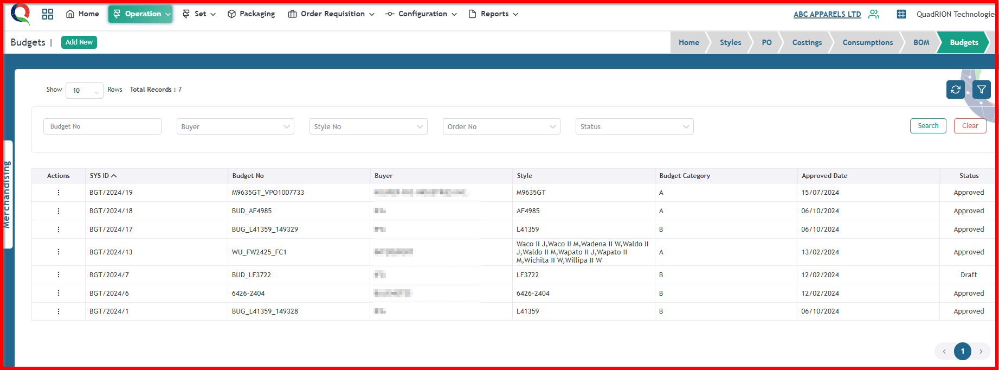
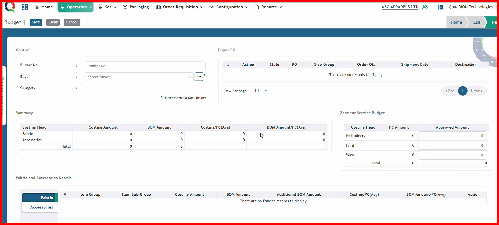

 

**Step 1:** First, click the Operation menu of the Merchandising module, then click the Budgets sub-menu.

After clicking 'Budgets' sub-menu, this Budgets list page will open.

**Step 2:** Click 'Add New' button.

After clicking the 'Add New' button, the Budget Add form will open.

 
**Step 3:** First, input the budget number, then select the buyer's name from the dropdown list.

Now click this ellipsis button.

After clicking the ellipsis button, the Buyer PO list will be visible.

Now, select the buyer PO by checking the checkbox, then click the 'OK' button.

After clicking 'Ok' button, summery with fabric and accessories information will be visible.

Click save button.

 After clicking save button, budget will be saved and a successful message will be visible.

 

