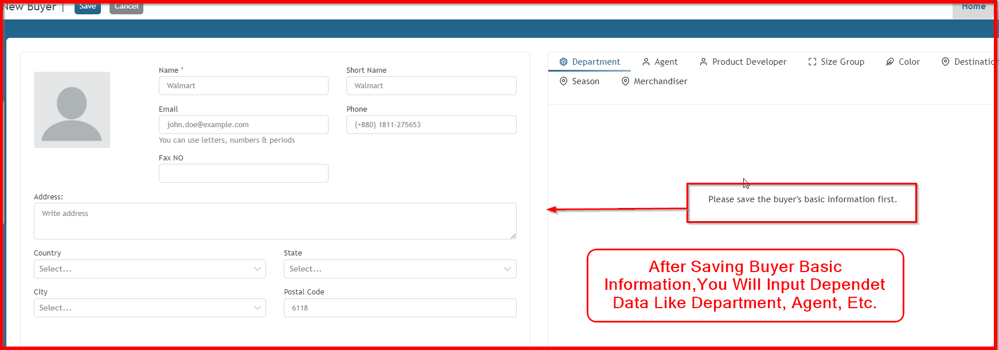

**Step 1:** First, log in by entering your valid username and password.

**Step 2:**  After logging in successfully, if you want to add a buyer, your web page must open the Merchandising module. Select the Module button.

**Step 3:**  After clicking module the button, you will get this module list. Then select your module.

**Step 4:** To open the Buyer page, you should select the Configuration menu. Then you will select Buyer.

**Step 5:** After opening the Buyer List page, if you want to find the Buyer form to add buyer information, click the Add New button.

After clicking the Add New button, you can see this Buyer Add form. After saving your buyer information, you can also input buyer-related other dependent information which you will see in the Style form.

If you don’t find any dependent data in Department, Agent, Product Developer, Size Group, Color, Destination, Sizes, or Merchandiser, you should save the data from those specific forms. You can also save data instantly from here, except for Merchandiser.

**Step 6:** Now you can add buyer information using this form.

**Step 7:** After saving buyer basic information, you can add all dependent data. Now you can add a merchandiser for this specific buyer.

**Step 8:** If you want to add a buyer department for your specific buyer, firstly click the Department button, then choose your department or create your department.

You can save other dependent information in the same way. Suppose you need to add color for your specific buyer. You should click the Color button, select a color from the dropdown list, or instantly create a color by typing. After that, click the Save button.

