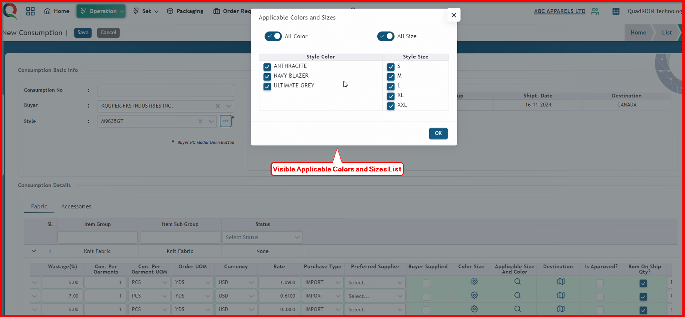

 

**Step 1:** First, click the Operation menu of the Merchandising module, then click the Consumptions sub-menu.

After clicking 'Consumptions' sub-menu, this consumptions list  page will open.

**Step 2:** Click "Add New" button to open consumptions add form.

After clicking "Add New" button, this consumptions add form will open.

**Step 3:** Now, select buyer and style information from dropdown list.

**Step 4:** To add buyer po infortamion, click ellipsis button

After clicking ellipsis, buyer po list will visible.

Choose your buyer po by clicking check box from list, then click ok button. You can select multiple buyer po from the list.

After clicking the OK button, the buyer's PO information will be displayed. Along with this, fabric and accessory information will also be shown simultaneously.

Here, I will explain the fabric details. You can add accessory information by following the fabric details.

**Step 5:** Click this expand button.

After clicking this expand button, fabric details information will be visible.

After place mouse pointer in the scrollbar, drag the scroollbar to the right side to revel the more content of the page.

Now you can see other information of fabric details.

Click color size button.

After clicking color size button,color size sentivity modal window will be visible.

Now click on this dropdown list box.

After clicking on this dropdown list box, color sensitivity list will be visible.

**Color Sensitivity Options**

1. **As per Gmt Color**  
   - This mapping will configure automatically based on the garment's color.

2. **For All Gmt Color**  
   - If a single color is chosen for all garment colors, configure it using this option

3. **Color Mapping**  
   - For custom mapping, where a different color is assigned to each specific garment color, choose this option.
  

If you required sensitivity is 'As per Gmt' color, select As per Gmt.
    

Since you select 'As per Gmt', you don't need to select color.Click ok button.

**Note: Size Sensitivity Options Rule Is Same As Color Sensitivity Options**

To configure applicable color and size, click this applicable color and size button.

After clicking this applicable color and size button,style color and size list will be visible.

By default, all colors and sizes are visible as selected. Choose your preferred color and size, then click the OK button.

To configure applicable destination, click this applicable destination button.

After clicking this applicable destination button,destination list will be visible.

By default, all destination visible as selected. Choose your preferred destination, then click the OK button.

If you check this option, the BOM will be generated based solely on the consumption quantity. Otherwise, the BOM will include both the consumption and wastage quantities. By default this check box visible as check state.

**Step 6:** After given all information, click 'Is Approve' check box.

**Step 7:** Now click save button.

After clicking submit bitton, consumption will save with creating a Consumption No automatically, and a successful message will be visible

To add more fabric informatin to existing consumption, click expand button.

Click this edit button include fabric informatin into consumption.

You can change default value by dropdown list of every informatin.

The configuration of color, size, destination, approval checking, and saving remains the same as the previous method.

After clicking the Save button, the consumption will be updated, and a success message will be displayed.

 

