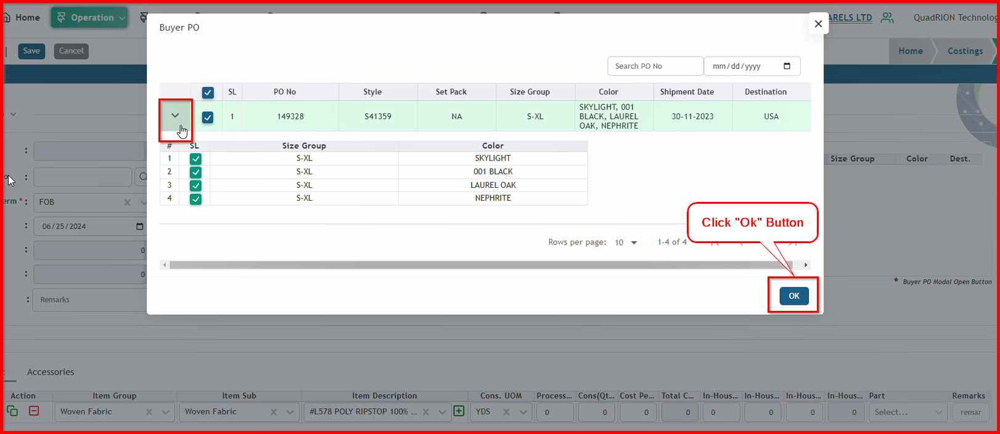
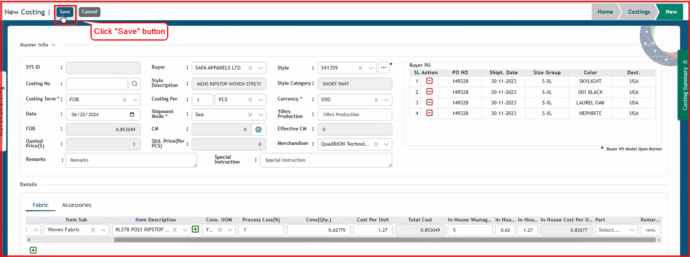

 

**Step 1:** Firstly choose your style from style list for auto costing. Click ellipse button to open modal

Now you can see a modal by clicking the ellipse button. You can open different pages from here. Click “Costing” button to open the “Costing" page.

This is the costing list page. We can see only the 'Buyer Name' and 'Style No' information because we haven't created the costing yet.

**Step 2:** Click "Add New" Button to open Costing Add Form

After clicking "Add New" Button we can see this Costing Form. Some data automacially save like Buyer, Style, Style Description, Style Category  from Style form as we select specific style no. 

There have also default data like Costing Per, Currency.This is default Costing Per Value:

This is default Currency Value:

This is default date:

After input all information including Shipment Mode, Merchandiser, Costing No. We need to add Buyer Po information.

**Step 3:** Click this "Ellipse" to open Buyer Po Modal.

After clicking Ellipse , we can see this modal. This is Buyer Po list of the given specific style no. Any single style can have single or multiple buyer po.

If you want to see size and color information, and try to input specific color and size wise information from buyer po, click this errow button to expand buyer po, and select your color and size.

Single or multiple selection of Size group and color

If you want to select all size group and color, click this check box

After selecting single or multiple size group and color, click ok button.

After clicking "ok" button Size Group and Color of Buyer Po save this area.

You can also remove any Size Group and Color by clicking this button.

**Step 3:** Now we need to input details information for costing. 1st Fabric information comes from style form.

There have two calculated values. One is "Total Cost" another one is "In House Cost"

After inputting all the information for an "Item Group" of fabric details, if you want to see the current costing summary, click the "Costing Summary" button.

After clicking the "Costinng Summery" button, we can see this summery.

Since we have input only one piece of information for the fabric, it is displaying the calculated value based on the given information. This data will change after adding more fabric details. On the other hand, we haven't input any Accessories information yet, which is why the Accessories value is showing as 0.

After clicking the "Costinng Summery" button, we can see this summery.

Click "Save" button for save auto costing information.

After clicking "Save" button System Id and Costing No. data save automatically.

Click edit button to change value or increase fabric or accessories information

FOB and Quoted Prices are also saved after clicking the save button. After adding fabric,accessories CM or other costing information, these values will change according to the calculations.

When the CM value is entered in the input field, the total of "Buyer and In-House Amount" changes automatically in the costing summary. However, "FOB and Quoted Prices" are not saved automatically before clicking the save button. Please input the CM value and then click the save button.

After clicking the save button, you will see that the FOB and Buyer Amount are equal, while the Quoted Prices and In-House Amount are equal.

You can add more fabric details information by plus button.

If you want to add Accessories information, click "Accessories" button.

After clicking the add button, you can add Accessories information just like fabric information.

After inputting all in accessories information, total cost of accessories showing in costing summery like fabric information. Besides this, Calculated FOB and Quted Prices value also change.

If you want to change status, click dropdown=> choose your status=> click save button

If you choose approve, "Approved By" and "Approved Date" information save autmatically.

