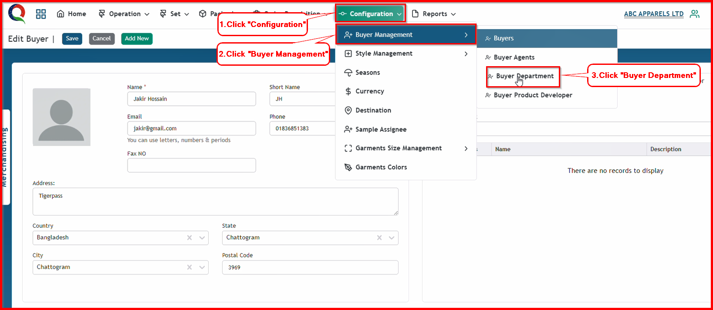

 

**Step 1:** First, click the Configuration menu of the Merchandising module, then click the Buyer Management sub-menu, and finally, click Buyer Department

After clicking Buyer Department button, this buyer department page will open.

**Step 2:** Click "Add New" button to open Buyer Department add form.

After clicking Buyer Department button, this buyer department page will open.

**Step 3:** Click "Add New" button to open Buyer Department add form.

After clicking the 'Submit' button, the buyer department will be saved, and a success message will be displayed.

**Step 4:** If you want to find your information from list, type your department name in serarch box and click "Search" button.

After clicking search button, if your data saved previously, you will get your data.

**Step 5:** If you want to edit your information, firstly click ellipse button, then click edit button 

After clicking edit button you will see this edit form of your selected data.

Now change your data from "Name" and "Description" input box, then click "Submit" button.

After clicking the 'Submit' button, your previous data will change, and you will see a success message.

**Step 6:** Open your buyer information, which you alrady save previously, or create a buyer. If you want to add department in your buyer information, firstly click department button, then type your department name which you saved in buyer department, finally click your department name

After clicking the department name, this buyer department will save in buyer information, and you will see a success message.

If you haven't created an department on the Buyer Department page, you can also create an department instantly from here and save it into the buyer information.

Firstly type your new department name, then select your department name with using 'Create' word.

So , new department will also save in buyer information with showing successful message

