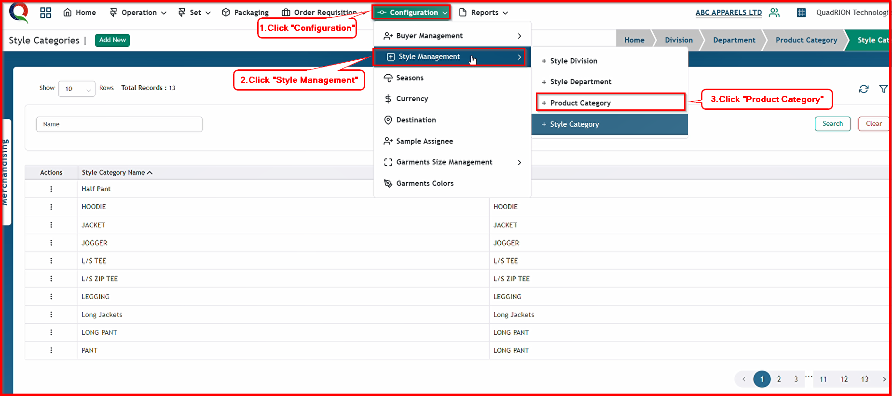
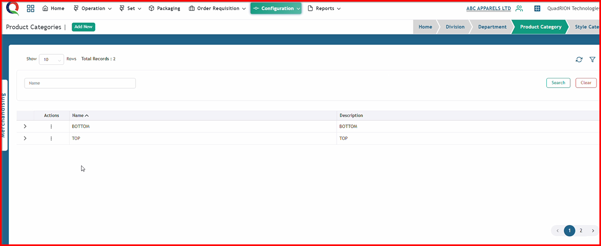
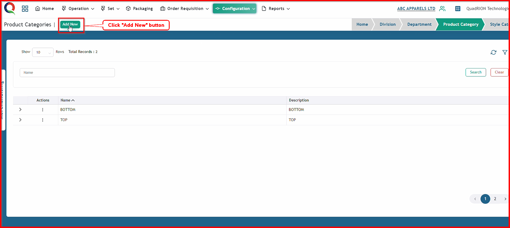
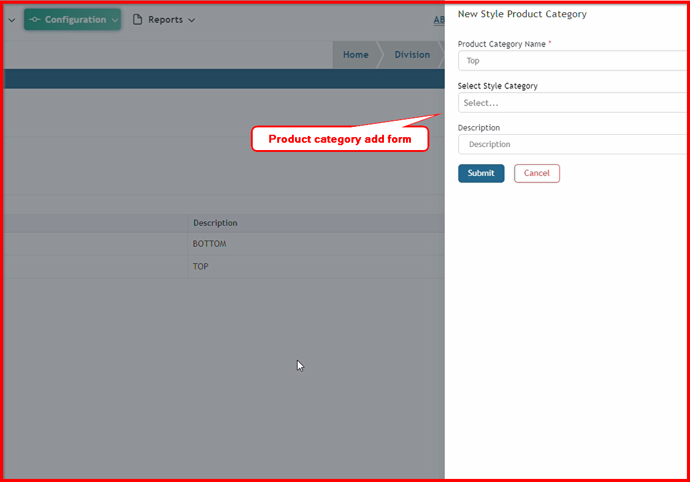
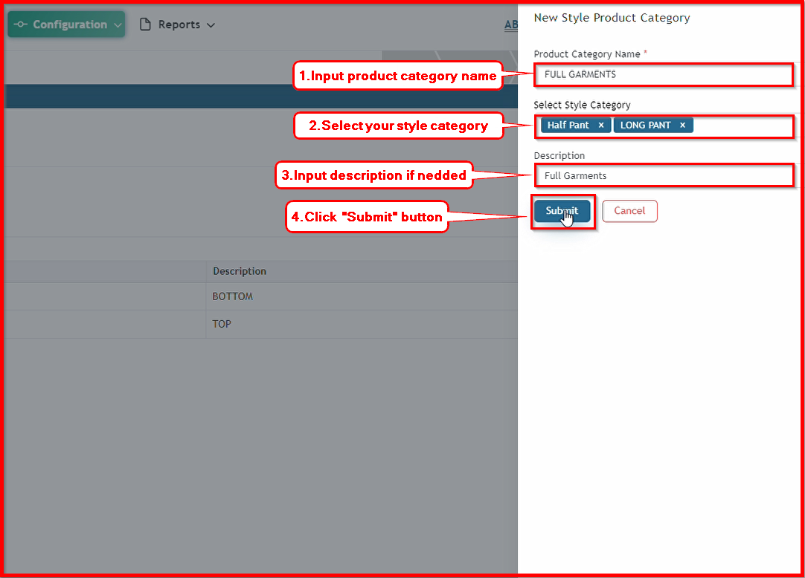
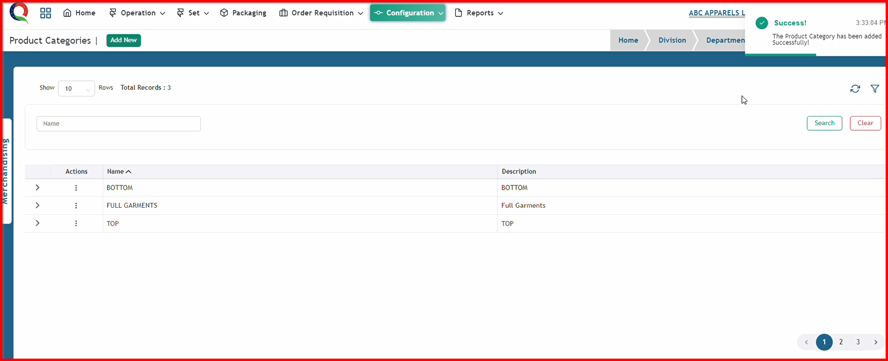

 

**Step 1:** First, click the Configuration menu of the Merchandising module, then click the Style Management sub-menu, and finally, click Product Category.

After clicking Product Category, this product categories page will open.

**Step 2:** Click "Add New" button to open Product Category add form.

After clicking "Add New" button, this sroduct category add form will open.

**Step 3:** Now, input all the information in this form and click the 'Submit' button.

After clicking the 'Submit' button, the product category will be saved, and a success message will be displayed.

