 

**Step 1:** First, click the Configuration menu of the Merchandising module, then click the Buyer Management sub-menu, and finally, click Buyer Product Developer.

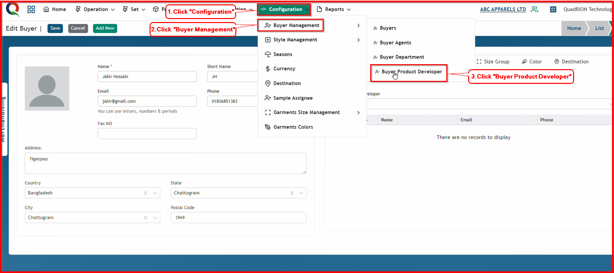

After clicking 'Buyer Product Developer' button, this buyer product developer page will open.

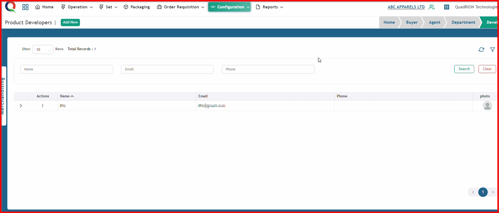

**Step 2:** Click "Add New" button to open 'Buyer Product Developer' add form.

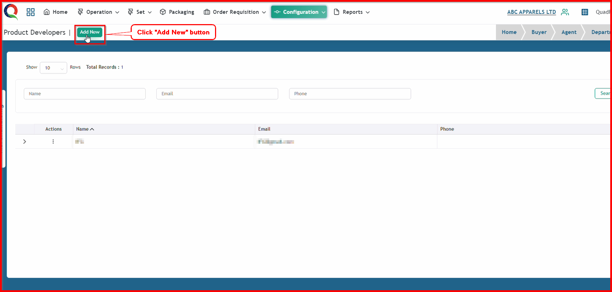

After clicking "Add New" button, this product developer form will open.

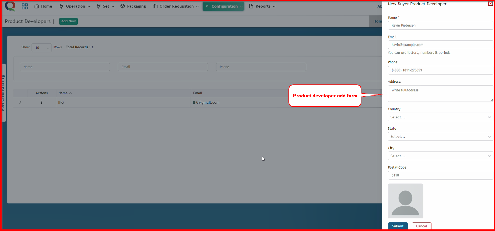

**Step 3:** Now, input all the information in this form and click the 'Submit' button.

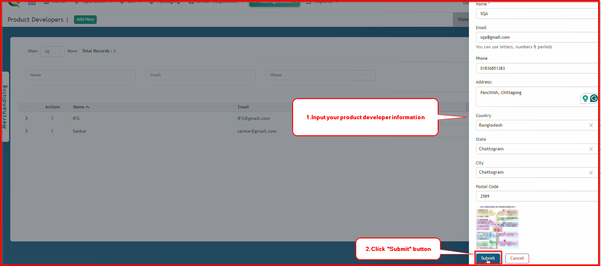

After clicking the 'Submit' button, the product developer will be saved, and a success message will be displayed.

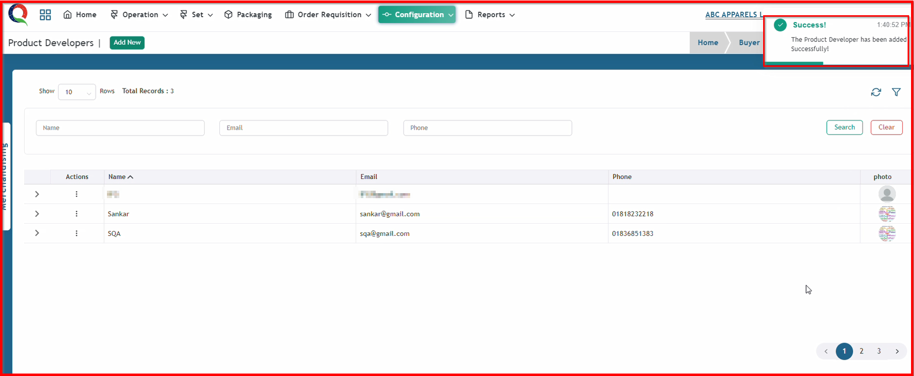

**Step 4:** Open the buyer information that you have already saved, or create a new buyer. If you want to add a 'product developer' to your buyer information, first click the 'Product Developer' button.

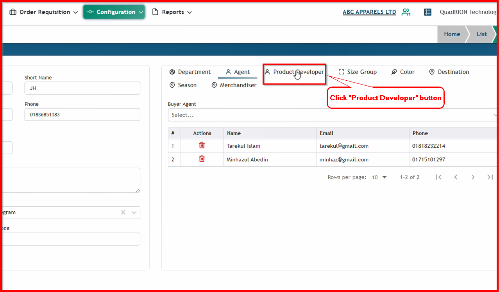

After clicking the 'Product Developer' button, the product developer dropdown box will become visible.

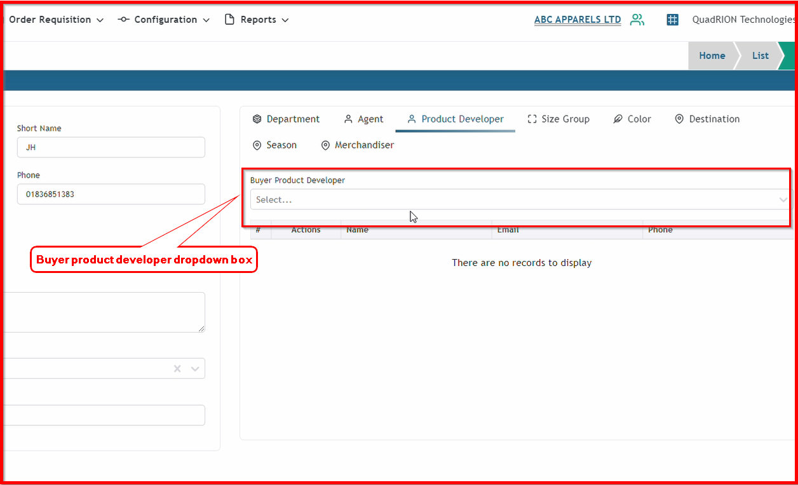

**Step 5:** Now, type your product developer  name and select your product developer  from the list that you saved previously on the 'Buyer Product Developer'  page.

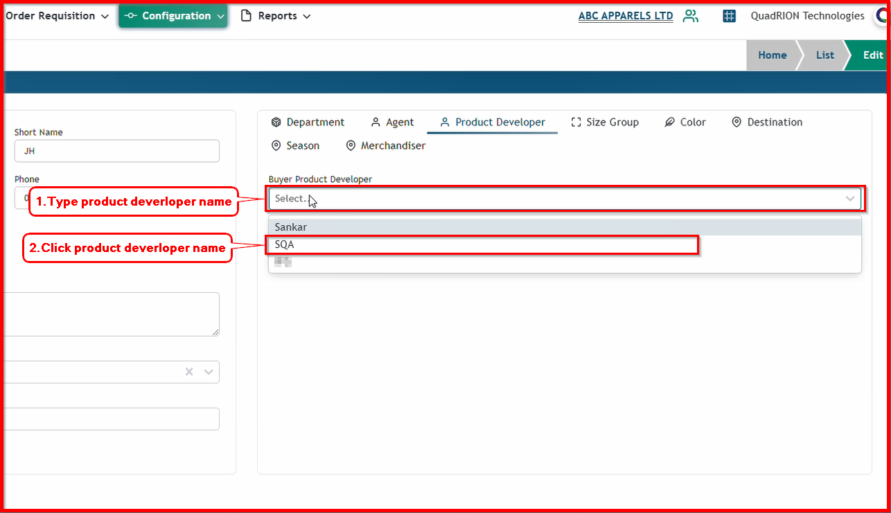

After clicking the product developer's name, the product developer will be saved in your buyer information, and a success message will be displayed.

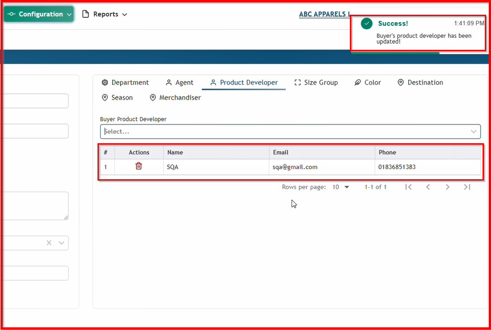

**Step 6:** If you haven't created a product developer on the Buyer Product developer Page, you can also create a product developer instantly from here and save it into the buyer information.

First, type your new product developer's name, then select your product developer's name using the 'Create' option.

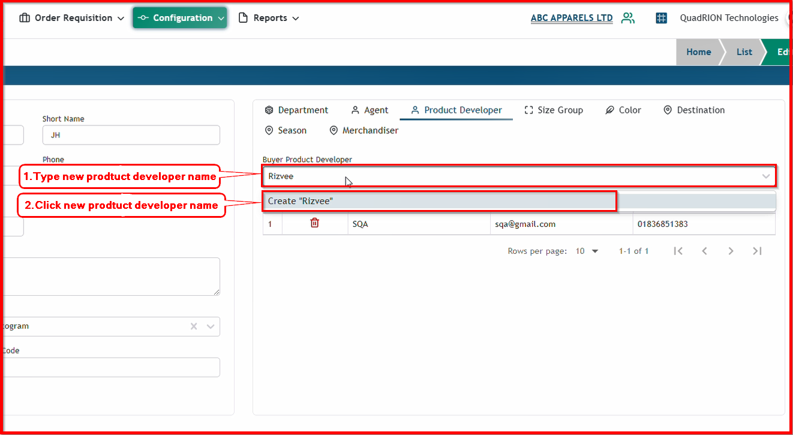

After clicking the new product developer's name with the 'Create' option, you will see the new product developer form.
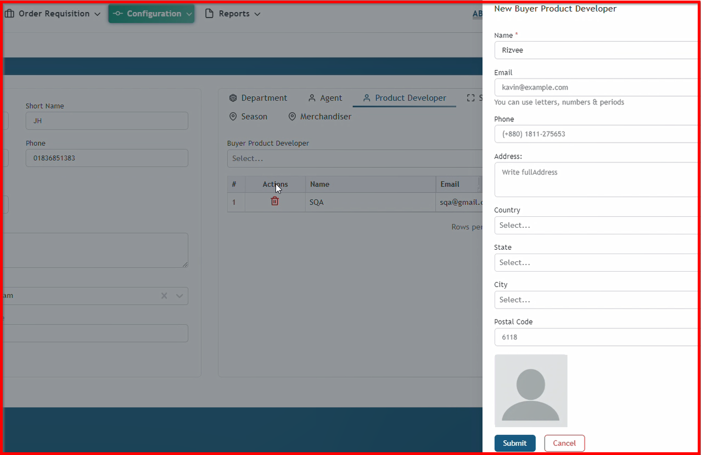

Now, input all the information in this form and click the 'Submit' button.

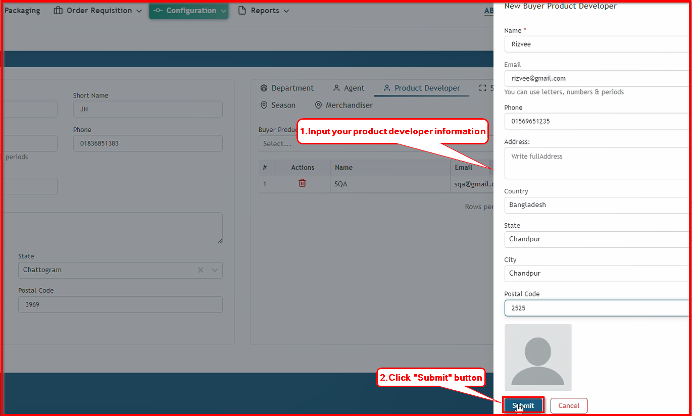

So , new product developer will also save in buyer information with showing successful message.

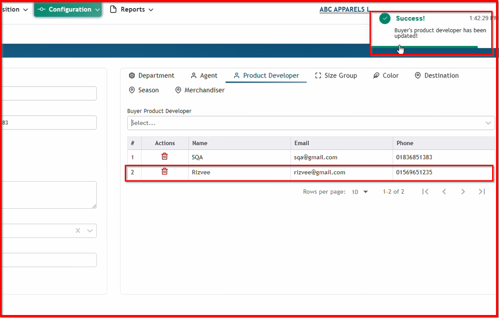

