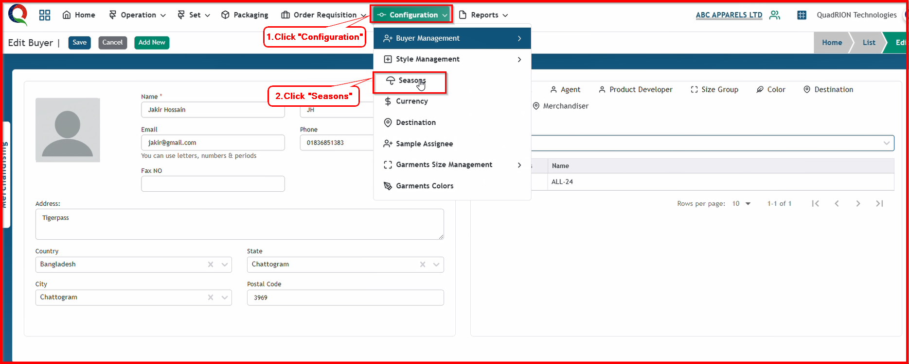
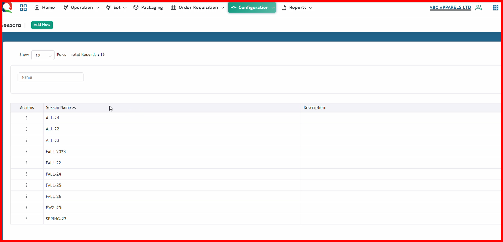
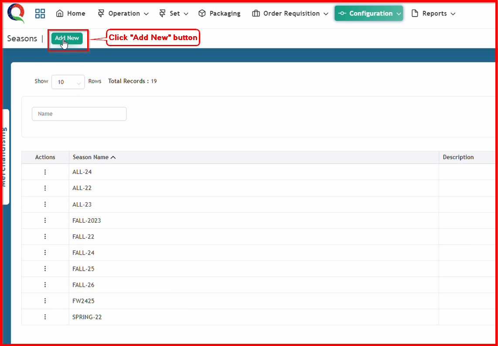
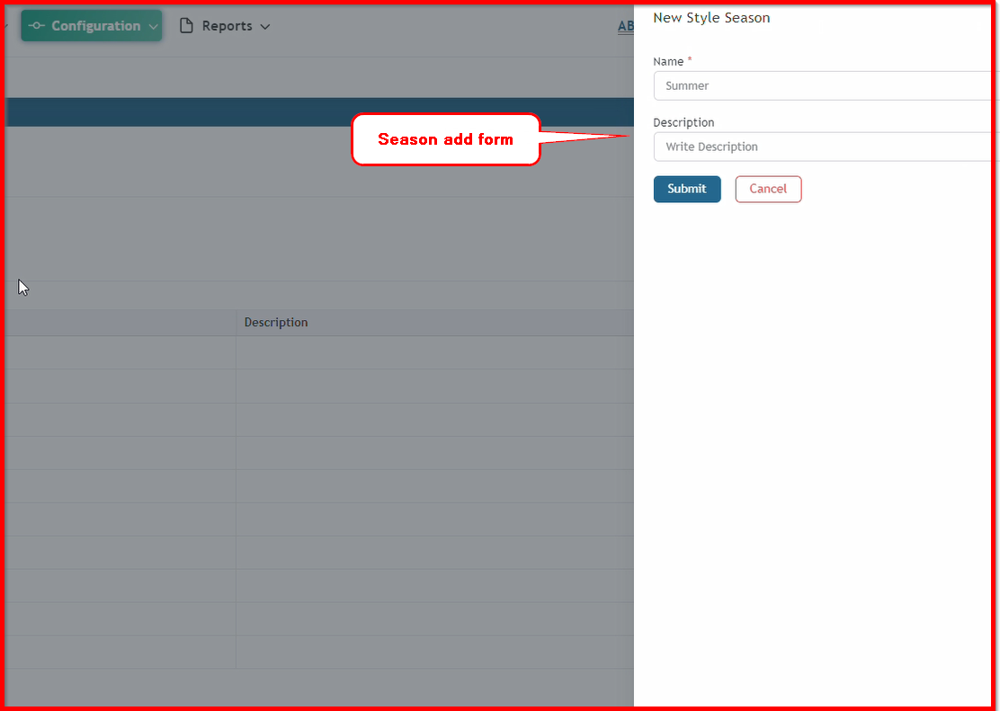
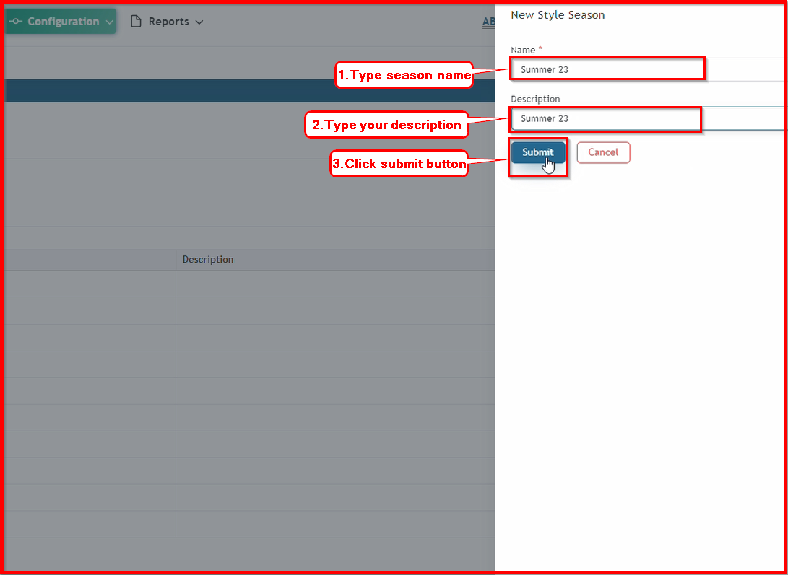
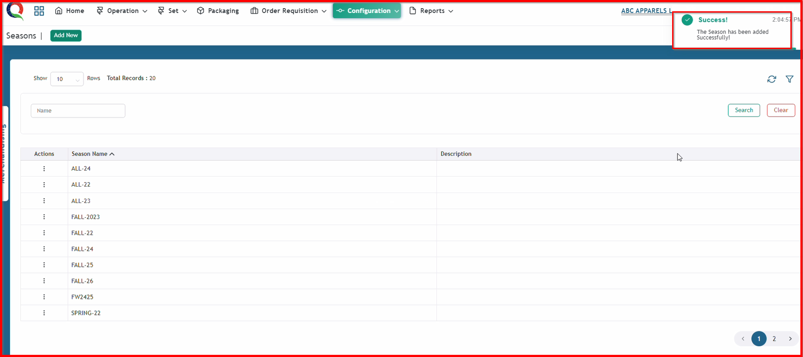

 

**Step 1:** First, click the Configuration menu of the Merchandising module, then click the Seasons sub-menu.

After clicking Seasons sub-menu, this seasons page will open.

**Step 2:** Click "Add New" button to open Season add form.

After clicking "Add New" button, this season add form will open.

**Step 3:** Now, input essential  information in this form and click the 'Submit' button.

After clicking the 'Submit' button, the season will be saved, and a success message will be displayed.

