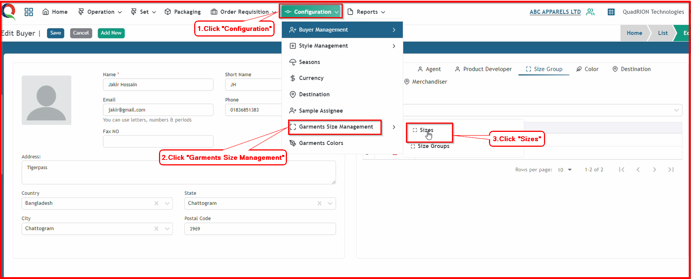

 

**Step 1:** First, click the Configuration menu of the Merchandising module, then click the Garments Size Management sub-menu, and finally, click Sizes.

After clicking Sizes, this style sizes page will open.

**Step 2:** Click "Add New" button to open Buyer Agent add form.

After clicking "Add New" button, this size add form will open.

**Step 3:** Now, input all the information in this form and click the 'Submit' button.

After clicking the 'Submit' button, the size will be saved, and a success message will be displayed.

**Step 4:** Now you need to create size group. First, click the Configuration menu of the Merchandising module, then click the Garments Size Management sub-menu, and finally, click Size Groups.

After clicking Size Groups, this style size groups page will open.

**Step 5:** Click "Add New" button to open Size Group add form.

After clicking "Add New" button, this size group add form will open.

**Step 6:** Now, input all the information in this form and click the 'Submit' button.

After clicking the 'Submit' button, the size group will be saved, and a success message will be displayed.

**Step 7:** Open the buyer information that you have already saved, or create a new buyer. If you want to add a 'size group' to your buyer information, first click the 'Size Group' button.

After clicking the 'Size Group' button, the size group dropdown box will become visible.

**Step 8:** Now, type your size group  name and select your size group from the list that you saved previously on the 'Style Size Group' page.

After clicking the size group's name, the size group will be saved in your buyer information, and a success message will be displayed.

**Step 9:** If you haven't created a size group on the Style Size Group page, you can also create a size group instantly from here and save it into the buyer information.

First, type your new size group's name, then select your size group's name using the 'Create' option.

After clicking the new size group's name with the 'Create' option, you will see the new size group form.

Now, input all the information in this form and click the 'Submit' button.

So , new size group will also save in buyer information with showing successful message.

