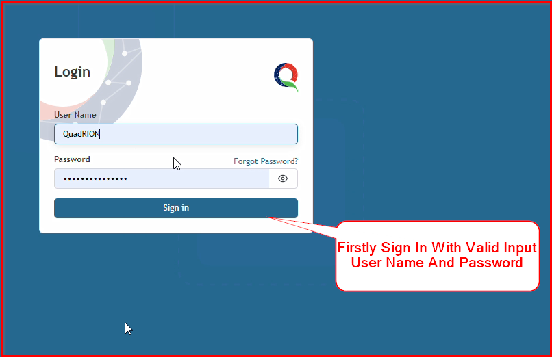
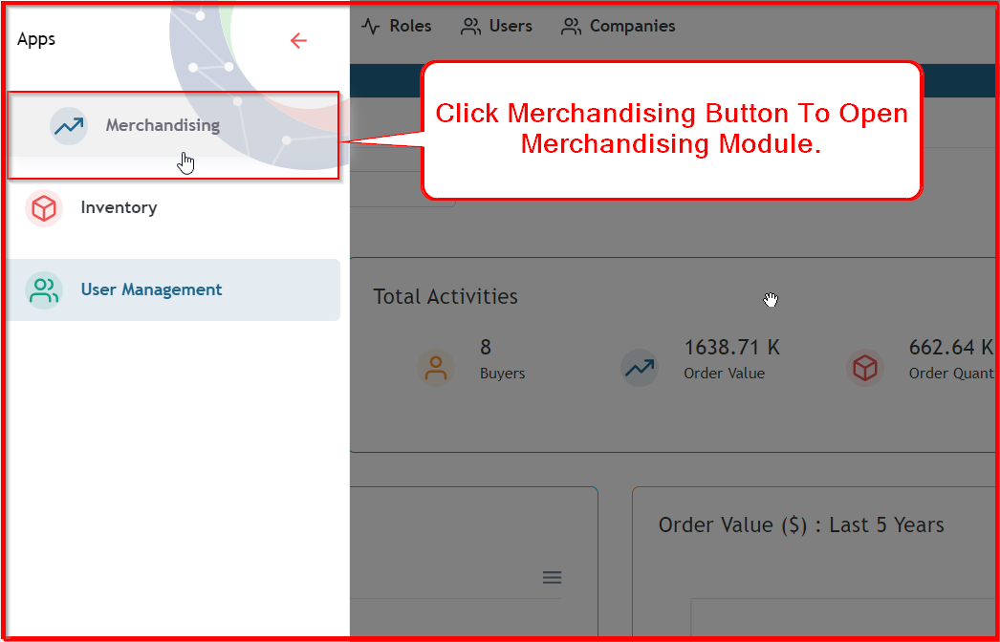

**Step 1:** First, log in by entering your valid username and password.

**Step 2:** After logging in successfully, if you want to add a buyer, your web page must open the Merchandising module. Select the Module button.

**Step 3:** After clicking the Module button, you will get this module list. Then select your module.

**Step 4:** To open the style page, you should select the "Operation" menu. Then, you will select the "Style" menu.

**Step 5:** After opening the style list page, if you want to find the style form for adding style, click the “Add New” button.

After clicking the Add New button, you can see the style add form. After saving your style information, you can proceed with other operations such as buyer PO, costing, etc.

If you don’t find any dependent data like (Buyer, Style Division, Size, Color, Merchandiser List, Fabric Category), you should save data from those specific forms.

**Step 6:** Now you can add buyer information using these fields. Firstly, select the buyer name, then you will find buyer-related data like season, buyer department, buyer agent, etc.

**Step 7:** Style number is input the first time in this field. There is no drop-down list. By typing data, you can input the style number.

**Step 8:** If you want to input style information data, you need to confirm that all dependent data has already been saved in the Inventory module. First, save the Style Division, then you will find the Style Department. After selecting the Style Department, you will find the Product Category. After finding the Product Category, you can finally select the Style Category. You must follow this flow.

**Step 9:** If you want to input size range and color, you need to confirm that sizes and colors are saved in the buyer information. Without selecting a buyer, you cannot get size range and color data in this style form.

**Step 10:** To add a style number, you need fabric category data. If your fabric category is configured previously, just select your fabric category from the drop-down list. If you don’t find your required category, you must configure your fabric category. Click the Edit button to configure your fabric category.

**Step 11:** By clicking the Edit button, you will see this modal. 

Then, choose your item group and segment value for configuring fabric category.

**Step 12:** Merchandising data is also dependent on the buyer. Without configuring, you cannot find the merchandiser in the Style form. If you are logged in as a merchandiser, this data is automatically populated. You can also change it from this list.

**Step 13:** The status list is not dependent on the Buyer form like other information. This is important for the next operation. If your status is "Confirmed Po", then you can add Buyer Po information. Otherwise, you can’t add Buyer Po.

**Step 14:** Documents are not dependent on the Buyer form. You can upload, download, and remove documents at any time from the Style form.

**Step 15:** You can upload multiple photos at a time. You also have the option to remove photos.

**Step 16:** You can set a default photo based on your priority list. You can also delete photos from here.

**Step 17:** Here you can see two pieces of information. The first one is "SYS ID," which means System ID. This will be input automatically after saving your style. The other one is the checkbox for "Used In Set Pack." If your style will be used in a set, you must select this checkbox.

**Step 18:** By clicking this Save button, your style will be saved. If any mandatory data is missing, the style will not be saved.

**Step 19:** This page is shown in view mode. After successfully saving the style by clicking the Save button, you will see a success message. Your style add form will automatically change to view mode. You have several options such as editing this style. You can add a new style using the Add button or Clone button. There is also a Cancel button. By clicking the Cancel button, your page will open as a list page where you can see all styles.

