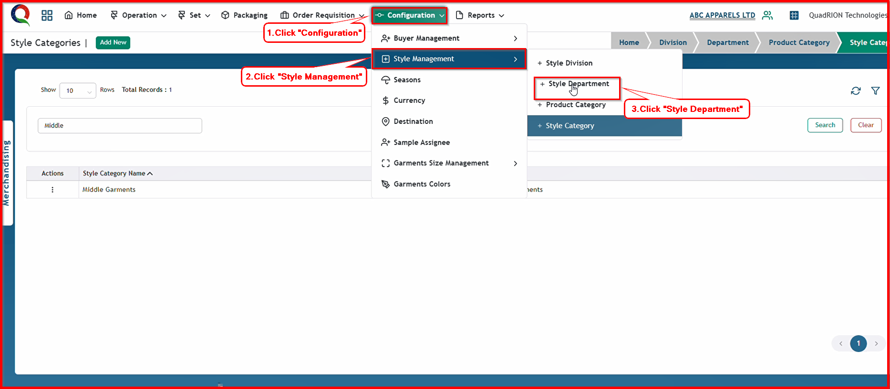
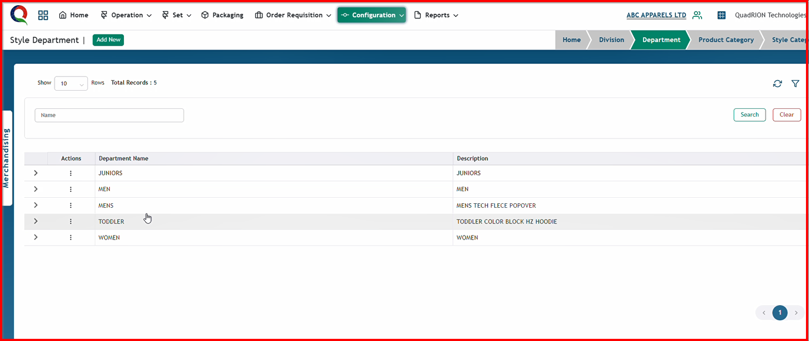
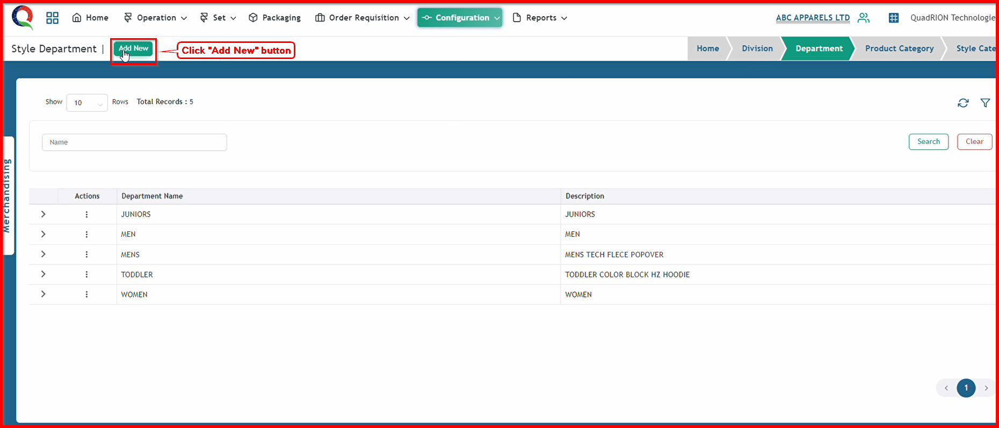
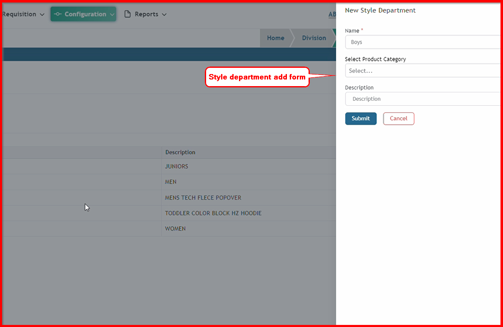
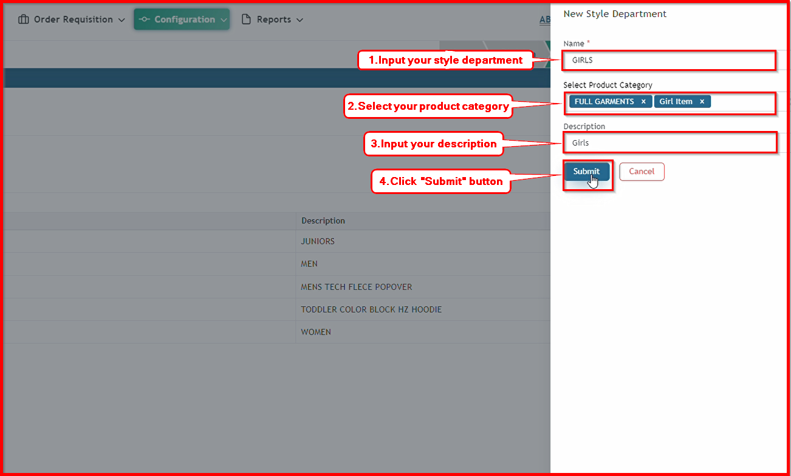
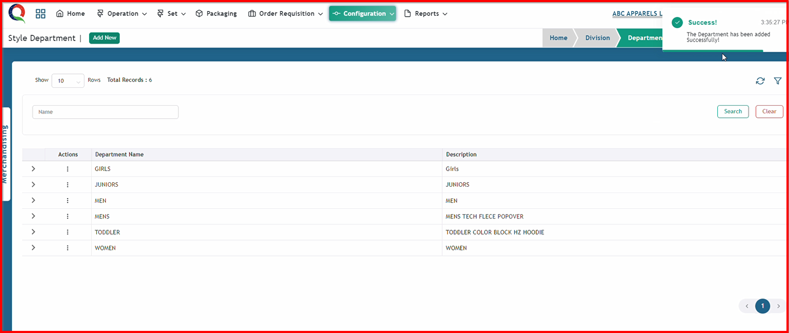

 

**Step 1:** First, click the Configuration menu of the Merchandising module, then click the Style Management sub-menu, and finally, click Style Department.

After clicking Style Department, this style department page will open.

**Step 2:** Click "Add New" button to open Style Department add form.

After clicking "Add New" button, this style department add form will open.

**Step 3:** Now, input all the information in this form and click the 'Submit' button.

After clicking the 'Submit' button, the style department will be saved, and a success message will be displayed.

